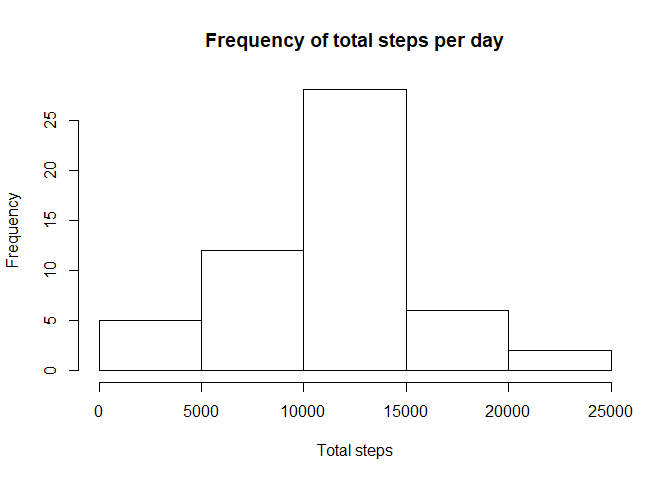
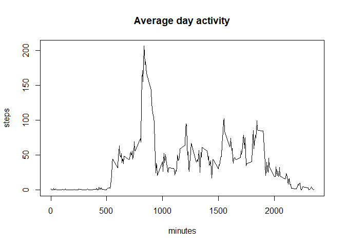
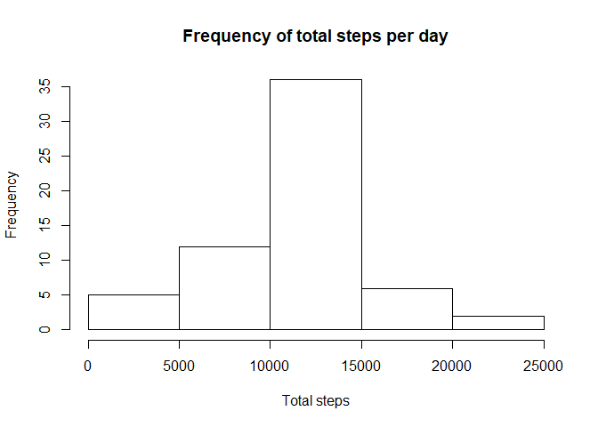
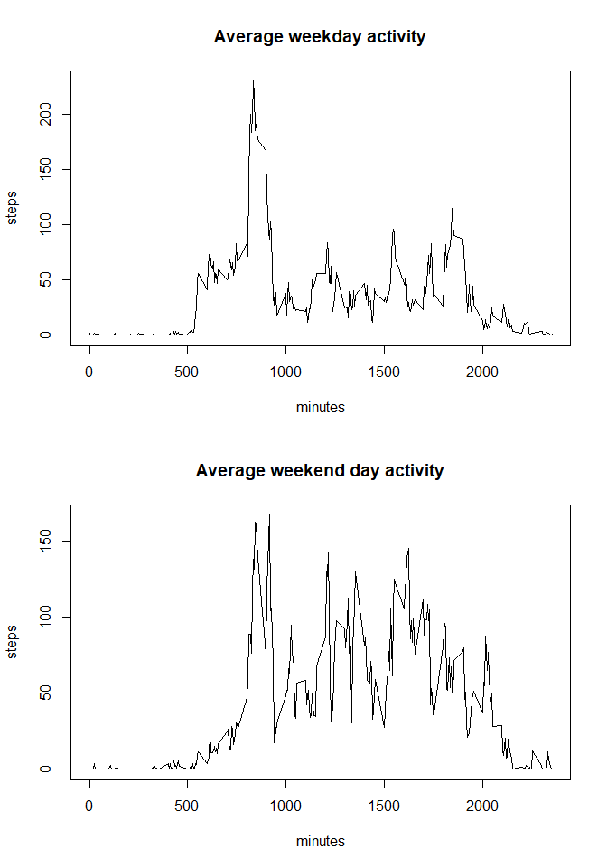

1. Loading and processing the data
----------------------------------

For this analysis we must load and process the raw data. This data was
obtained from the internet, and represents the total steps, recorded by
a wearable device every 5 minutes of each day in October and November
2012.

    #checks if file exists; if not, downloads zip file
    if(!file.exists("./activity.zip")){
            fileURL <- "https://d396qusza40orc.cloudfront.net/repdata%2Fdata%2Factivity.zip"
            download.file(fileURL,destfile = "./activity.zip", method = "auto")
    }

    #opens files and loads them to a data frame
    steps <- read.csv(unz("./activity.zip","activity.csv"))

2. What is mean total number of steps taken per day?
----------------------------------------------------

Ignoring the missing values of the dataset, we calculate the total steps
per day. We make a bar chart from this info. Additionally, we calculate
the mean and median from the 5 minute intervals for each day.

    #total steps per day
    totalsteps <- aggregate(steps$steps, by = list(steps$date), FUN=sum)
    names(totalsteps) <- c("day","total steps")

    #Creates a histogram
    hist(totalsteps$`total steps`, main = "Frequency of total steps per day", xlab = "Total steps")

    #calculates mean and median steps
    meansteps <- aggregate(steps$steps, by = list(steps$date), FUN=mean, na.rm=TRUE)
    names(meansteps) <- c("day","mean for 5 min")
    mediansteps <- aggregate(steps$steps, by = list(steps$date), FUN=median, na.rm=TRUE)
    names(mediansteps) <- c("day","median for 5 min")

    #Creates a dataframe with all three for convenience
    stepsperday <- merge(totalsteps, meansteps, by.x = "day", by.y = "day")
    stepsperday <- merge(stepsperday, mediansteps, by.x = "day", by.y = "day")
    print(stepsperday)

    ##           day total steps mean for 5 min median for 5 min
    ## 1  2012-10-01          NA            NaN               NA
    ## 2  2012-10-02         126      0.4375000                0
    ## 3  2012-10-03       11352     39.4166667                0
    ## 4  2012-10-04       12116     42.0694444                0
    ## 5  2012-10-05       13294     46.1597222                0
    ## 6  2012-10-06       15420     53.5416667                0
    ## 7  2012-10-07       11015     38.2465278                0
    ## 8  2012-10-08          NA            NaN               NA
    ## 9  2012-10-09       12811     44.4826389                0
    ## 10 2012-10-10        9900     34.3750000                0
    ## 11 2012-10-11       10304     35.7777778                0
    ## 12 2012-10-12       17382     60.3541667                0
    ## 13 2012-10-13       12426     43.1458333                0
    ## 14 2012-10-14       15098     52.4236111                0
    ## 15 2012-10-15       10139     35.2048611                0
    ## 16 2012-10-16       15084     52.3750000                0
    ## 17 2012-10-17       13452     46.7083333                0
    ## 18 2012-10-18       10056     34.9166667                0
    ## 19 2012-10-19       11829     41.0729167                0
    ## 20 2012-10-20       10395     36.0937500                0
    ## 21 2012-10-21        8821     30.6284722                0
    ## 22 2012-10-22       13460     46.7361111                0
    ## 23 2012-10-23        8918     30.9652778                0
    ## 24 2012-10-24        8355     29.0104167                0
    ## 25 2012-10-25        2492      8.6527778                0
    ## 26 2012-10-26        6778     23.5347222                0
    ## 27 2012-10-27       10119     35.1354167                0
    ## 28 2012-10-28       11458     39.7847222                0
    ## 29 2012-10-29        5018     17.4236111                0
    ## 30 2012-10-30        9819     34.0937500                0
    ## 31 2012-10-31       15414     53.5208333                0
    ## 32 2012-11-01          NA            NaN               NA
    ## 33 2012-11-02       10600     36.8055556                0
    ## 34 2012-11-03       10571     36.7048611                0
    ## 35 2012-11-04          NA            NaN               NA
    ## 36 2012-11-05       10439     36.2465278                0
    ## 37 2012-11-06        8334     28.9375000                0
    ## 38 2012-11-07       12883     44.7326389                0
    ## 39 2012-11-08        3219     11.1770833                0
    ## 40 2012-11-09          NA            NaN               NA
    ## 41 2012-11-10          NA            NaN               NA
    ## 42 2012-11-11       12608     43.7777778                0
    ## 43 2012-11-12       10765     37.3784722                0
    ## 44 2012-11-13        7336     25.4722222                0
    ## 45 2012-11-14          NA            NaN               NA
    ## 46 2012-11-15          41      0.1423611                0
    ## 47 2012-11-16        5441     18.8923611                0
    ## 48 2012-11-17       14339     49.7881944                0
    ## 49 2012-11-18       15110     52.4652778                0
    ## 50 2012-11-19        8841     30.6979167                0
    ## 51 2012-11-20        4472     15.5277778                0
    ## 52 2012-11-21       12787     44.3993056                0
    ## 53 2012-11-22       20427     70.9270833                0
    ## 54 2012-11-23       21194     73.5902778                0
    ## 55 2012-11-24       14478     50.2708333                0
    ## 56 2012-11-25       11834     41.0902778                0
    ## 57 2012-11-26       11162     38.7569444                0
    ## 58 2012-11-27       13646     47.3819444                0
    ## 59 2012-11-28       10183     35.3576389                0
    ## 60 2012-11-29        7047     24.4687500                0
    ## 61 2012-11-30          NA            NaN               NA

3. What is the average daily activity pattern?
----------------------------------------------

Here, I created an analysis of what the average day would look like. It
is then ploted into a time series. Furthermore, the data set is analyzed
to find the interval with the highest average number of steps.

    #calculates and plots the average day
    averageday <- aggregate(steps$steps, by = list(steps$interval), FUN=mean, na.rm=TRUE)
    names(averageday) <- c("interval","steps")
    plot(averageday, type="l", main = "Average day activity", xlab = "minutes")

    #indicates the interval with the highest activity
    highestinterval <- averageday[which(averageday$steps == max(averageday$steps)),1]
    print(paste("The highest level of activity was, on average, between minute", highestinterval, 
                "and minute", highestinterval+5, "each day."))

    ## [1] "The highest level of activity was, on average, between minute 835 and minute 840 each day."

4. Imputing missing values
--------------------------

Given the incompleteness of the dataset, I make an effort to report the
ammount of NAs; after this, missing values are replaced with the average
for that interval across all days. A new “stepscomplete” dataset is
created by this method. Further, to prove the effectiveness of this
method, we recalculate the average meassurements from section 2 using
the new data.  
The frequency histogram shows that the average is overrepresented in the
completed dataset, this is to be expected, given the replacement method.
The median is also afected, as it was 0 in most days, but is leveraged
up in corrected days (due to most averages being above 0, since at least
one day has activity at that interval).

    #counts NA values
    numberNA <- sum(is.na(steps$steps))
    print(paste("There are", numberNA, "missing values."))

    ## [1] "There are 2304 missing values."

    #replaces NA with average values for that interval
    stepscomplete <- steps
    for (i in 1:17568) {
            if (is.na(stepscomplete[i,]$steps)){
                    stepscomplete[i,]$steps <- averageday[which(averageday$interval == stepscomplete[i,]$interval),]$steps
            }
    }

    #repeats analysis from step 2

    totalstepscomplete <- aggregate(stepscomplete$steps, by = list(stepscomplete$date), FUN=sum)
    names(totalstepscomplete) <- c("day","total steps")
    hist(totalstepscomplete$`total steps`, main = "Frequency of total steps per day", xlab = "Total steps")

    meanstepscomplete <- aggregate(stepscomplete$steps, by = list(stepscomplete$date), FUN=mean)
    names(meanstepscomplete) <- c("day","mean for 5 min")
    medianstepscomplete <- aggregate(stepscomplete$steps, by = list(stepscomplete$date), FUN=median)
    names(medianstepscomplete) <- c("day","median for 5 min")
    stepsperdaycomplete <- merge(totalstepscomplete, meanstepscomplete, by.x = "day", by.y = "day")
    stepsperdaycomplete <- merge(stepsperdaycomplete, medianstepscomplete, by.x = "day", by.y = "day")
    print(stepsperdaycomplete)

    ##           day total steps mean for 5 min median for 5 min
    ## 1  2012-10-01    10766.19     37.3825996         34.11321
    ## 2  2012-10-02      126.00      0.4375000          0.00000
    ## 3  2012-10-03    11352.00     39.4166667          0.00000
    ## 4  2012-10-04    12116.00     42.0694444          0.00000
    ## 5  2012-10-05    13294.00     46.1597222          0.00000
    ## 6  2012-10-06    15420.00     53.5416667          0.00000
    ## 7  2012-10-07    11015.00     38.2465278          0.00000
    ## 8  2012-10-08    10766.19     37.3825996         34.11321
    ## 9  2012-10-09    12811.00     44.4826389          0.00000
    ## 10 2012-10-10     9900.00     34.3750000          0.00000
    ## 11 2012-10-11    10304.00     35.7777778          0.00000
    ## 12 2012-10-12    17382.00     60.3541667          0.00000
    ## 13 2012-10-13    12426.00     43.1458333          0.00000
    ## 14 2012-10-14    15098.00     52.4236111          0.00000
    ## 15 2012-10-15    10139.00     35.2048611          0.00000
    ## 16 2012-10-16    15084.00     52.3750000          0.00000
    ## 17 2012-10-17    13452.00     46.7083333          0.00000
    ## 18 2012-10-18    10056.00     34.9166667          0.00000
    ## 19 2012-10-19    11829.00     41.0729167          0.00000
    ## 20 2012-10-20    10395.00     36.0937500          0.00000
    ## 21 2012-10-21     8821.00     30.6284722          0.00000
    ## 22 2012-10-22    13460.00     46.7361111          0.00000
    ## 23 2012-10-23     8918.00     30.9652778          0.00000
    ## 24 2012-10-24     8355.00     29.0104167          0.00000
    ## 25 2012-10-25     2492.00      8.6527778          0.00000
    ## 26 2012-10-26     6778.00     23.5347222          0.00000
    ## 27 2012-10-27    10119.00     35.1354167          0.00000
    ## 28 2012-10-28    11458.00     39.7847222          0.00000
    ## 29 2012-10-29     5018.00     17.4236111          0.00000
    ## 30 2012-10-30     9819.00     34.0937500          0.00000
    ## 31 2012-10-31    15414.00     53.5208333          0.00000
    ## 32 2012-11-01    10766.19     37.3825996         34.11321
    ## 33 2012-11-02    10600.00     36.8055556          0.00000
    ## 34 2012-11-03    10571.00     36.7048611          0.00000
    ## 35 2012-11-04    10766.19     37.3825996         34.11321
    ## 36 2012-11-05    10439.00     36.2465278          0.00000
    ## 37 2012-11-06     8334.00     28.9375000          0.00000
    ## 38 2012-11-07    12883.00     44.7326389          0.00000
    ## 39 2012-11-08     3219.00     11.1770833          0.00000
    ## 40 2012-11-09    10766.19     37.3825996         34.11321
    ## 41 2012-11-10    10766.19     37.3825996         34.11321
    ## 42 2012-11-11    12608.00     43.7777778          0.00000
    ## 43 2012-11-12    10765.00     37.3784722          0.00000
    ## 44 2012-11-13     7336.00     25.4722222          0.00000
    ## 45 2012-11-14    10766.19     37.3825996         34.11321
    ## 46 2012-11-15       41.00      0.1423611          0.00000
    ## 47 2012-11-16     5441.00     18.8923611          0.00000
    ## 48 2012-11-17    14339.00     49.7881944          0.00000
    ## 49 2012-11-18    15110.00     52.4652778          0.00000
    ## 50 2012-11-19     8841.00     30.6979167          0.00000
    ## 51 2012-11-20     4472.00     15.5277778          0.00000
    ## 52 2012-11-21    12787.00     44.3993056          0.00000
    ## 53 2012-11-22    20427.00     70.9270833          0.00000
    ## 54 2012-11-23    21194.00     73.5902778          0.00000
    ## 55 2012-11-24    14478.00     50.2708333          0.00000
    ## 56 2012-11-25    11834.00     41.0902778          0.00000
    ## 57 2012-11-26    11162.00     38.7569444          0.00000
    ## 58 2012-11-27    13646.00     47.3819444          0.00000
    ## 59 2012-11-28    10183.00     35.3576389          0.00000
    ## 60 2012-11-29     7047.00     24.4687500          0.00000
    ## 61 2012-11-30    10766.19     37.3825996         34.11321

5. Are there differences in activity patterns between weekdays and weekends?
----------------------------------------------------------------------------

We analyze the dataset to answer a final question. A vector was added to
the completed dataset inidcating whether a day is a weekday or weekend.
The average weekday and weekend day activities were ploted as was done
in section 3. We can clearly see more activity on our weekend days.

    #added weekday identifier. 
    #NOTE: my version of R is in spanish, to replicate this in English change "sábado" to "Satuday" and "domingo" to "Sunday".
    stepscomplete$date <- as.Date(stepscomplete$date, format = "%Y-%m-%d")
    stepscomplete$weekday <- as.character(1:17568)
    for (i in 1:17568) {
            if (weekdays(stepscomplete[i,]$date) == "sábado" || weekdays(stepscomplete[i,]$date) == "domingo"){
                    stepscomplete[i,]$weekday <- "weekend"
            } else {
                    stepscomplete[i,]$weekday <- "weekday"
            }
    }

    #average weekday
    stepsweekdays <- stepscomplete[which(stepscomplete$weekday == "weekday"),]
    averageweekday <- aggregate(stepsweekdays$steps, by = list(stepsweekdays$interval), FUN=mean, na.rm=TRUE)
    names(averageweekday) <- c("minutes","steps")

    #average weekend day
    stepsweekends <- stepscomplete[which(stepscomplete$weekday == "weekend"),]
    averageweekends <- aggregate(stepsweekends$steps, by = list(stepsweekends$interval), FUN=mean, na.rm=TRUE)
    names(averageweekends) <- c("minutes","steps")

    #plots
    par(mfrow = c(2,1))
    plot(averageweekday, type="l", main = "Average weekday activity")
    plot(averageweekends, type="l", main = "Average weekend day activity")

